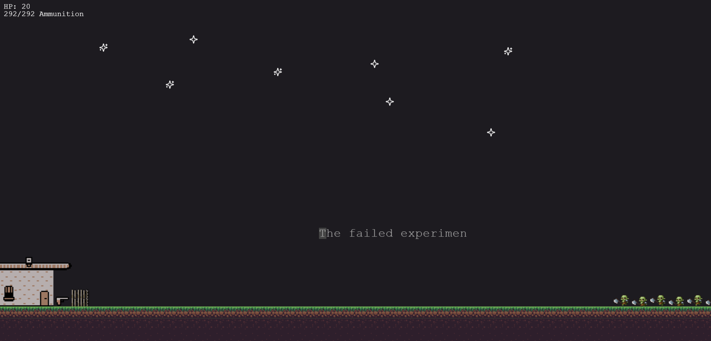

# 🧟‍♂️ Zombietyper

A typing game where you defend your fortress against waves of zombies by typing words. Every level is a journal entry from a survivor of the apocalypse, and your choices can determine the story’s path.



## 🎯 Why I Developed This

I thought about my journey on learning typing and figured that it honestly wasn't a lot of fun. And why would anyone want to learn this skill if it is just brute-force hour long typing? That's why I wanted to gamify the learning and came up with this game!

It has also been an immense learning project, as I have never developed a game in the web. (wonder why the repo's name has a v2 in it). It took some time to wrap my head around the mechanics of scenes, physics, dynamic sprite creation and so much more. But yeah, this is the end result, which I am proud of (bc I actually finished the project 😅).

Feel free to further advance the story, add new levels, or improve the game in any other aspect!

## 🚀 About the Game

Type words to eliminate incoming zombies.
Manage your ammunition - mistyped shots are wasted!
Make story-driven choices that affect the game’s outcome.
Built as a fun way to improve typing skills while playing.

## 🛠️ Built With

-   Phaser 3 – Game framework
-   React - As a wrapper framework
-   TypeScript
-   a bit of Figma

## 📥 Installation & Running the Game

Clone this repository:

```
git clone https://github.com/AndyTrendygth/zombietyperv2.git
cd zombietyperv2
```

Install dependencies:

```
npm i
```

Start the server:

```
npm run dev
```

Have fun!

built with ❤ by andyytr

